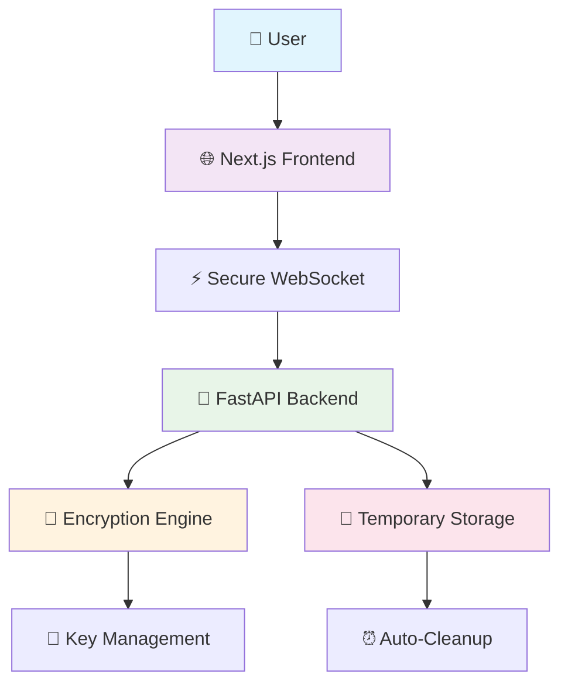
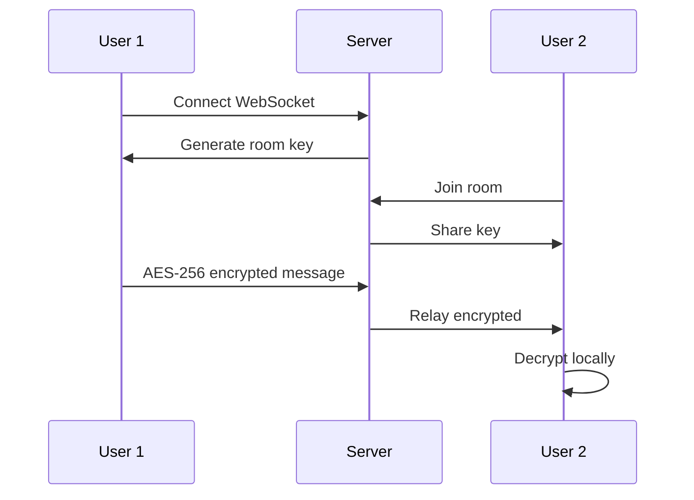

# 🔒 Anonymous Chat - Secure and Private Communication

<div align="center">


**Anonymous chat system with end-to-end encryption, secure file sharing and auto-deletion**

[🚀 Live Demo](https://write-ghost.netlify.app) | [📖 Español](README.md) | [🔧 Installation](#-installation-and-setup)

**🌐 [Español](README.md) | English**

</div>

## 📋 Table of Contents

- [🌟 Key Features](#-key-features)
- [🏗️ System Architecture](#️-system-architecture)
- [🚀 Installation and Setup](#-installation-and-setup)
- [📖 User Guide](#-user-guide)
- [🔍 Security Specifications](#-security-specifications)
- [🌍 Deployment](#-deployment)
- [📊 Monitoring and Metrics](#-monitoring-and-metrics)
- [🛠️ Development and Contributing](#️-development-and-contributing)
- [🔒 Security Considerations](#-security-considerations)
- [📜 License and Terms](#-license-and-terms)
- [📚 Additional Documentation](#-additional-documentation)

</div>

---

## 🌟 Key Features

### 🛡️ **Maximum Security**
- **🔐 AES-256-GCM Encryption** - Military-grade standard for all messages and files
- **🔑 Diffie-Hellman Key Exchange** - Secure key negotiation without exposure
- **🚫 No Database** - Zero persistence of sensitive data
- **⏰ Smart Auto-Deletion** - Messages (10 min) and files (30 min)

### 👤 **Total Anonymity**
- **🎭 Temporary Identities** - Auto-generated users
- **🌈 Unique Avatars** - Distinctive colors without personal information
- **📊 No Registration** - Immediate access without creating accounts
- **🔄 Ephemeral Sessions** - Each connection is independent

### 📁 **Secure File Sharing**
- **🔒 Encrypted Content** - Files protected with AES-256
- **🏷️ Encrypted Metadata** - File names and types protected
- **📏 Smart Limits** - 15MB per file, 5 files per user
- **🗂️ Compatible Types** - Images, documents, audio and more

### 🏠 **Private Rooms**
- **🚪 Instant Creation** - Temporary rooms with unique codes
- **👥 User Management** - Access control per room
- **🔐 Independent Encryption** - Unique keys per private room
- **📱 Responsive Interface** - Optimized for mobile and desktop

---

## 🏗️ System Architecture



### 🔧 **Technology Stack**

| Component | Technology | Purpose |
|-----------|------------|---------|
| **Frontend** | Next.js 14 + TypeScript | Modern and responsive interface |
| **Backend** | FastAPI + Python | Efficient API with WebSockets |
| **Encryption** | AES-256-GCM + DH | Military-grade security |
| **Deployment** | Netlify + Render | Scalable infrastructure |
| **Storage** | Memory + Temporary Files | No persistence |

---

## 🚀 Installation and Setup

### 📋 **Prerequisites**
- **Python 3.11+** for backend
- **Node.js 18+** for frontend
- **Git** to clone the repository

### ⚡ **Quick Installation**

```bash
# Clone the repository
git clone https://github.com/h3n-x/chat-anonimo.git
cd chat-anonimo

# Setup Backend
cd backend
pip install -r requirements.txt
python main.py

# Setup Frontend (new terminal)
cd ../frontend
npm install
npm run dev
```

### 🌐 **Production Configuration**

#### Backend (Render/Railway)
```bash
# Required environment variables
PORT=8000
CORS_ORIGINS=https://your-frontend.netlify.app
```

#### Frontend (Netlify/Vercel)
```bash
# Build settings
Build command: npm run build
Publish directory: out
```

---

## 📖 User Guide

### 🎯 **Quick Access**
1. **Enter the chat** - No registration required
2. **Choose your room** - General or create a private one
3. **Start chatting** - Automatic encryption enabled
4. **Share files** - Drag and drop files

### 🔐 **Private Rooms**
```
1. Click "Create Private Room"
2. Share the 6-digit code
3. Maximum 10 users per room
4. Independent encryption per room
```

### 📁 **File Upload**
- **Methods**: Drag and drop or click 📎
- **Limits**: 15MB per file, 5 files per user
- **Formats**: Images, documents, audio, video
- **Security**: Automatic encryption of content and metadata

---

## 🔍 Security Specifications

### 🛡️ **Protection Levels**

| Element | Encryption | Storage | Retention |
|---------|------------|---------|-----------|
| **Messages** | ✅ AES-256-GCM | 🚫 Memory only | ⏰ 10 minutes |
| **Files** | ✅ AES-256-GCM | 📁 Encrypted temporary | ⏰ 30 minutes |
| **Metadata** | ✅ AES-256-GCM | 🚫 Memory only | ⏰ With file |
| **Keys** | ✅ Diffie-Hellman | 🚫 Memory only | ⏰ Per session |

### 🔒 **Encryption Flow**



### 🔐 **Algorithms Used**
- **Symmetric Encryption**: AES-256-GCM (Galois/Counter Mode)
- **Key Exchange**: Ephemeral Diffie-Hellman
- **Integrity**: HMAC integrated in GCM
- **Randomness**: Cryptographically secure nonces

---

## 🌍 Deployment

### 🎯 **Production URLs**
- **Frontend**: [https://write-ghost.netlify.app](https://write-ghost.netlify.app)
- **Backend**: [https://chat-backend-haeb.onrender.com](https://chat-backend-haeb.onrender.com)

### ⚙️ **CORS Configuration**
```python
# backend/main.py
app.add_middleware(
    CORSMiddleware,
    allow_origins=["https://write-ghost.netlify.app"],
    allow_credentials=True,
    allow_methods=["*"],
    allow_headers=["*"],
)
```

### 🔧 **Environment Variables**
```bash
# Backend
PORT=8000
CORS_ORIGINS=https://write-ghost.netlify.app
MAX_FILE_SIZE=15728640  # 15MB
MAX_FILES_PER_USER=5

# Frontend 
NEXT_PUBLIC_WS_URL=wss://chat-backend-haeb.onrender.com
```

---

## 📊 Monitoring and Metrics

### 📈 **System Limits**
- **👥 Concurrent Users**: No technical limit
- **📁 Total Files**: 30 simultaneous in system
- **💾 Memory Usage**: Auto-optimization with cleanup
- **🚀 Latency**: < 100ms for messages

### 🧹 **Auto-Cleanup**
```
⏰ Every 5 minutes:
  ├── 🗑️ Delete messages > 10 min
  ├── 🗑️ Delete files > 30 min
  ├── 🧹 Clean key memory
  └── 📊 Log statistics
```

---

## 🛠️ Development and Contributing

### 🏃‍♂️ **Local Development**
```bash
# Backend with hot-reload
cd backend
uvicorn main:app --reload --host 0.0.0.0 --port 8000

# Frontend with hot-reload  
cd frontend
npm run dev
```

### 🧪 **Testing**
```bash
# Backend tests
cd backend
python -m pytest tests/

# Frontend tests
cd frontend
npm run test
```

### 📝 **Project Structure**
```
chat-anonimo/
├── 📁 backend/
│   ├── 🐍 main.py          # Main FastAPI server
│   ├── 🔐 crypto_utils.py  # Encryption engine
│   ├── ⚙️ config.py        # Configuration
│   └── 🧪 tests/           # Unit tests
├── 📁 frontend/
│   ├── 🎨 app/             # Next.js pages
│   ├── 🧩 components/      # React components
│   ├── 🔧 lib/             # Utilities and API
│   └── 🎯 public/          # Static resources
└── 📖 README.md            # This file
```

---

## 📚 Additional Documentation

- 📖 **[README en Español](README.md)** - Spanish version of this document
- 🚀 **[Backend Documentation](backend/README.md)** - API and server configuration
- 🎨 **[Frontend Documentation](frontend/README.md)** - Components and development
- 🤝 **[Contributing Guide](CONTRIBUTING.md)** - How to contribute to the project
- 📜 **[License](LICENSE)** - MIT terms and conditions

---

## 🔒 Security Considerations

### ✅ **Implemented Strengths**
- **Zero-Knowledge**: Server cannot read messages
- **Perfect Forward Secrecy**: Unique keys per session
- **Auto-Destruction**: Guaranteed automatic deletion
- **No Logs**: Zero storage of sensitive content

### ⚠️ **Known Limitations**
- **Connection Metadata**: IPs visible at infrastructure level
- **Client Persistence**: Temporary local cache
- **Availability**: Dependent on third-party infrastructure

### 🔐 **Usage Recommendations**
- **VPN**: To hide real IP address
- **Tor Browser**: For maximum browsing anonymity
- **Incognito**: Avoid persistent browser cache

---

## 📜 License and Terms

### 📄 **MIT License**
This project is under the MIT License. See [LICENSE](LICENSE) for more details.

### ⚖️ **Terms of Use**
- **Responsible Use**: Not for illegal activities
- **No Warranties**: Software provided "as-is"
- **Privacy**: We don't collect personal data
- **Content**: Users are responsible for their content

---

## 🤝 Support and Contact

### 💬 **Community**
- **Issues**: [GitHub Issues](https://github.com/h3n-x/chat-anonimo/issues)
- **Discussions**: [GitHub Discussions](https://github.com/h3n-x/chat-anonimo/discussions)

### 🔧 **Contributing**
1. Fork the project
2. Create a feature branch (`git checkout -b feature/AmazingFeature`)
3. Commit your changes (`git commit -m 'Add some AmazingFeature'`)
4. Push to the branch (`git push origin feature/AmazingFeature`)
5. Open a Pull Request

### 🏆 **Acknowledgments**
- **Cryptography**: Python encryption library
- **FastAPI**: Modern and fast web framework
- **Next.js**: Production React framework
- **Open Source Community**: For the incredible tools

---

<div align="center">

**Made with ❤️ for privacy and freedom of communication**


</div>
