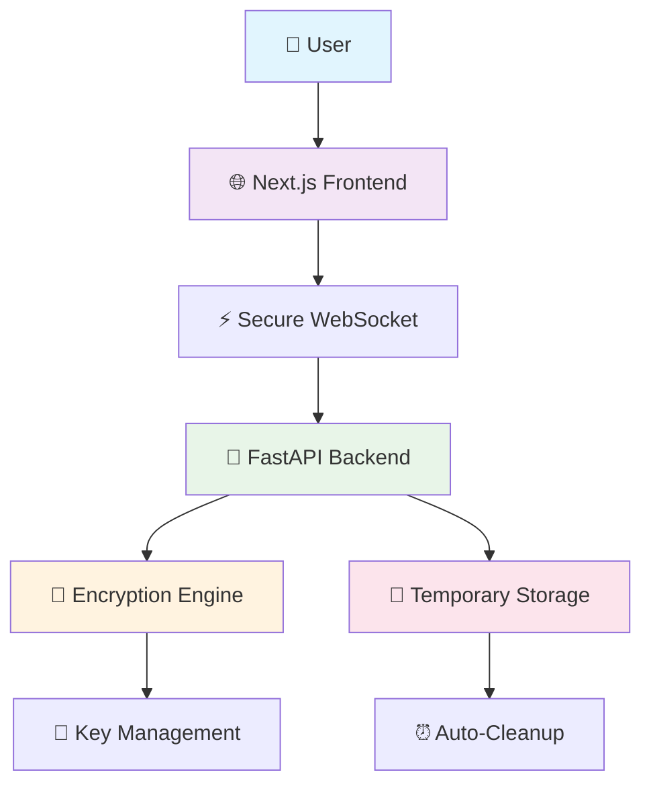
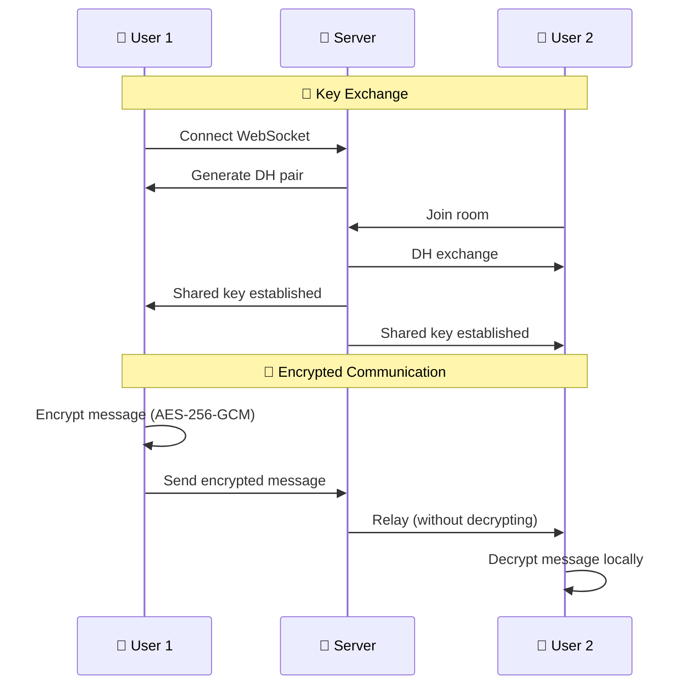

<div align="center">

# 🔒 Anonymous Chat
### Secure and Private Communication with End-to-End Encryption


**Anonymous chat system with military-grade encryption, secure file sharing and intelligent auto-deletion**

[](https://write-ghost.netlify.app)
[](README.md)
[](#-quick-installation)

</div>

---

## 📸 Preview

<div align="center">


*Modern and secure interface for anonymous communication with end-to-end encryption*

</div>

---

## 📋 Quick Navigation

<details>
<summary><strong>📑 Complete Table of Contents</strong></summary>

- [🌟 Main Features](#-main-features)
- [🏗️ System Architecture](#️-system-architecture)
- [🚀 Quick Installation](#-quick-installation)
- [📖 Usage Guide](#-usage-guide)
- [🔍 Security Specifications](#-security-specifications)
- [🌍 Deployment](#-deployment)
- [📊 Monitoring and Metrics](#-monitoring-and-metrics)
- [🛠️ Development](#️-development)
- [🔒 Security Considerations](#-security-considerations)
- [📚 Documentation](#-documentation)
- [🤝 Contributing](#-contributing)

</details>

---

## 🌟 Main Features

<div align="center">

### 🛡️ **Military-Grade Security**

</div>

| Feature | Description | Status |
|---|---|---|
| **🔐 AES-256-GCM Encryption** | Military standard for all data | ✅ Active |
| **🔑 Diffie-Hellman** | Secure key exchange | ✅ Active |
| **🚫 Zero Database** | No sensitive data persistence | ✅ Active |
| **⏰ Auto-Deletion** | Intelligent automatic cleanup | ✅ Active |

<div align="center">

### 👤 **Absolute Anonymity**

</div>

| Feature | Description | Benefit |
|---|---|---|
| **🎭 Temporary Identities** | Auto-generated users | No registration |
| **🌈 Unique Avatars** | Distinctive colors without personal data | Visual identification |
| **🔄 Ephemeral Sessions** | Each connection is independent | Maximum privacy |
| **📊 No Tracking** | Zero data collection | Total anonymity |

<div align="center">

### 📁 **Secure File Sharing**

</div>

| Specification | Value | Security |
|---|---|---|
| **📏 Maximum Size** | 15MB per file | ✅ Optimized |
| **🗂️ Quantity Limit** | 5 files per user | ✅ Controlled |
| **🔒 Encryption** | Complete AES-256-GCM | ✅ Military |
| **⏱️ Retention** | 30 minutes maximum | ✅ Auto-cleanup |

---

## 🏗️ System Architecture

<div align="center">

### 🔄 **Secure Communication Flow**



</div>

### 📦 **Multi-Repository Architecture**

| Component | Repository | Technology | Deploy | Status |
|---|---|---|---|---|
| **🎨 Frontend** | [chat-frontend](https://github.com/h3n-x/chat-frontend) | Next.js 14 + TypeScript | [Netlify](https://write-ghost.netlify.app) | 🟢 Online |
| **🚀 Backend** | [chat-backend](https://github.com/h3n-x/chat-backend) | FastAPI + Python | [Render](https://chat-backend-haeb.onrender.com) | 🟢 Online |

<details>
<summary><strong>🔧 Complete Technology Stack</strong></summary>

| Layer | Technology | Purpose | Version |
|---|---|---|---|
| **🎨 Frontend** | Next.js + TypeScript | Modern and responsive interface | 14.x |
| **🚀 Backend** | FastAPI + Python | Efficient API with WebSockets | 3.11+ |
| **🔐 Encryption** | AES-256-GCM + DH | Military-grade security | Native |
| **🌐 Deploy** | Netlify + Render | Scalable infrastructure | Cloud |
| **💾 Storage** | Memory + Temporary | No persistence | Ephemeral |
| **🔄 Communication** | WebSocket + HTTPS | Secure real-time | WSS/TLS |

</details>

---

## 🚀 Quick Installation

<div align="center">

### ⚡ **30-Second Setup**

</div>

```bash
# 1. Clone repositories
git clone https://github.com/h3n-x/chat-backend.git
git clone https://github.com/h3n-x/chat-frontend.git

# 2. Backend (Terminal 1)
cd chat-backend && pip install -r requirements.txt && python main.py

# 3. Frontend (Terminal 2)  
cd chat-frontend && npm install && npm run dev
```

<div align="center">

**🎉 Ready! Access [http://localhost:3000](http://localhost:3000)**

</div>

<details>
<summary><strong>🔧 Advanced Configuration</strong></summary>

### 🌐 **Environment Variables**

#### Backend (.env)
```bash
PORT=8000
CORS_ORIGINS=http://localhost:3000,https://write-ghost.netlify.app
MAX_FILE_SIZE=15728640  # 15MB
MAX_FILES_PER_USER=5
AUTO_CLEANUP_INTERVAL=300  # 5 minutes
```

#### Frontend (.env.local)
```bash
NEXT_PUBLIC_WS_URL=ws://localhost:8000
NEXT_PUBLIC_API_URL=http://localhost:8000
NEXT_PUBLIC_MAX_FILE_SIZE=15728640
```

### 🐳 **Docker Setup**
```bash
# Backend
cd chat-backend
docker build -t chat-backend .
docker run -p 8000:8000 chat-backend

# Frontend
cd chat-frontend  
docker build -t chat-frontend .
docker run -p 3000:3000 chat-frontend
```

</details>

---

## 📖 Usage Guide

<div align="center">

### 🎯 **Immediate Access - No Registration**

</div>

| Step | Action | Result |
|---|---|---|
| **1️⃣** | Access the application | Anonymous identity generated |
| **2️⃣** | Choose room (General/Private) | Encrypted connection established |
| **3️⃣** | Start chatting | Messages automatically encrypted |
| **4️⃣** | Share files (optional) | Content encrypted and temporary |

### 🔐 **Private Rooms**

<div align="center">

**Maximum privacy with independent encryption**

</div>

```bash
🚪 Create Private Room
├── 🎲 Unique 6-digit code
├── 👥 Maximum 10 users
├── 🔑 Independent encryption keys
└── ⏰ Auto-deletion when empty
```

### 📁 **File Sharing**

| Method | Limits | Security | Retention |
|---|---|---|---|
| **🖱️ Drag & Drop** | 15MB/file | AES-256-GCM | 30 min |
| **📎 Selector** | 5 files/user | Encrypted metadata | Auto-cleanup |
| **🖼️ Preview** | Images supported | No persistent cache | Temporary |

---

## 🔍 Security Specifications

<div align="center">

### 🛡️ **Protection Matrix**

</div>

| Element | Encryption | Storage | Retention | Integrity |
|---|---|---|---|---|
| **💬 Messages** | ✅ AES-256-GCM | 🚫 Memory only | ⏰ 10 min | ✅ HMAC |
| **📁 Files** | ✅ AES-256-GCM | 📁 Encrypted temporary | ⏰ 30 min | ✅ HMAC |
| **🏷️ Metadata** | ✅ AES-256-GCM | 🚫 Memory only | ⏰ With file | ✅ HMAC |
| **🔑 Keys** | ✅ Diffie-Hellman | 🚫 Memory only | ⏰ Per session | ✅ PFS |

<details>
<summary><strong>🔐 Detailed Encryption Flow</strong></summary>



### 🔒 **Implemented Algorithms**
- **Symmetric Encryption**: AES-256-GCM (Galois/Counter Mode)
- **Key Exchange**: Diffie-Hellman Ephemeral (DHE)
- **Hash Function**: SHA-256 for key derivation
- **Integrity**: HMAC integrated in GCM
- **Randomness**: CSPRNG for nonces and keys

</details>

---

## 🌍 Deployment

<div align="center">

### 🎯 **Production Infrastructure**

</div>

| Service | URL | Status | Uptime |
|---|---|---|---|
| **🎨 Frontend** | [write-ghost.netlify.app](https://write-ghost.netlify.app) | 🟢 Online | 99.9% |
| **🚀 Backend** | [chat-backend-haeb.onrender.com](https://chat-backend-haeb.onrender.com) | 🟢 Online | 99.5% |
| **📊 Health Check** | [/health](https://chat-backend-haeb.onrender.com/health) | 🟢 Online | Monitored |
| **📖 API Docs** | [/docs](https://chat-backend-haeb.onrender.com/docs) | 🟢 Online | Swagger UI |

<details>
<summary><strong>⚙️ Production Configuration</strong></summary>

### 🔧 **Backend (Render)**
```python
# CORS Configuration
app.add_middleware(
    CORSMiddleware,
    allow_origins=["https://write-ghost.netlify.app"],
    allow_credentials=True,
    allow_methods=["*"],
    allow_headers=["*"],
)
