<div align="center">



<br/><br/>

# 🔒 Anonymous Chat v2.5 — Privacy & Anti-Surveillance Suite
### Military-Grade Ephemeral Messaging with Native Zero-Knowledge Blind Relay & In-RAM Sovereign Cryptography


**High-security communication platform built upon strict Zero Trust and Zero Forensic Footprint principles.**  
*No accounts. No phone numbers. No database. No metadata retention. Mathematically verifiable cryptography.*

[🚀 Live Interactive Demo](https://chat-zk.netlify.app) • [📖 Versión en Español](README.md) • [💻 Frontend Repository](https://github.com/h3n-x/chat-frontend) • [⚙️ Backend Repository](https://github.com/h3n-x/chat-backend)

</div>

---

## 💡 The Manifesto: Why We Built Anonymous Chat

We exist in an era of **pervasive dragnet surveillance, metadata harvesting, and behavioral social graph profiling**:

* **WhatsApp (Meta):** While it encrypts message bodies, it harvests and cross-references your communication metadata at scale: whom you speak to, at what time, from which coordinates, how often, and who is in your address book.
* **Telegram:** By default **does not end-to-end encrypt** standard conversations or groups; it stores cleartext chat histories on cloud servers susceptible to law enforcement subpoenas or infrastructure compromise.
* **Signal:** Despite its strong cryptographic protocol, **mandates registration tied directly to a mobile phone number**, exposing users to SIM-swapping attacks, carrier identification, and state-level deanonymization.

> **Our Thesis:**  
> True privacy is not merely hiding what was said; it is **destroying all evidence that the conversation ever took place**.

**Anonymous Chat** was designed to eliminate the concept of user accounts and server-side data persistence entirely. If our server is seized, subpoenaed, or raided by an adversary, investigators will discover zero user logs, zero databases, and zero keys—only an unauthenticated, blind WebSocket relay pipe forwarding opaque, mathematically indecipherable byte streams through volatile RAM.

---

## 🎯 Target Audience & Real-World Impact

This is not just another web chat; it is a **tactical anti-surveillance suite** engineered for high-stakes environments where communication breaches lead to severe physical, legal, or corporate consequences:

| User Profile | Real-World Scenario | Core Protective Features |
|---|---|---|
| **📰 Investigative Journalists** | Receiving leaks and coordinating with confidential sources in hostile jurisdictions. | *Automatic EXIF/GPS scrubbing, voice scrambler biometric masking, and remote collective nuke.* |
| **📣 Whistleblowers** | Reporting corporate malfeasance or state misconduct without leaving forensic trails on work devices. | *Duress Decoy Room (PIN `9999`), View-Once media, and LSB image steganography.* |
| **🕊️ Human Rights Activists** | Coordinating under authoritarian regimes, civil unrest, or internet blackouts. | *Active decoy traffic generation, Tor Browser / `.onion` support, and idle RAM auto-purge.* |
| **💼 Corporate Executives & Legal Teams** | High-stakes M&A negotiations, settlement terms, or trade secret consultations. | *Zero cloud persistence, 30s clipboard auto-scrubbing, and out-of-band SAS anti-MITM verification.* |
| **🛡️ Incident Response & Red Teams** | Secure Out-of-Band (OOB) Command & Control channel when the enterprise network is fully compromised. | *Instant URL Hash rooms, BIP-39 24-word passphrases, and complete infrastructure independence.* |
| **👥 Privacy-Conscious Individuals** | Anyone refusing to have their intimate human conversations commoditized, indexed, or monitored. | *Instant zero-install browser execution, zero trackers, and zero accounts.* |

---

## ⚔️ Competitive Analysis: How We Compare

| Security Feature | Anonymous Chat v2.5 | WhatsApp | Telegram | Signal |
|---|:---:|:---:|:---:|:---:|
| **Requires Phone Number / Email** | ❌ **No (100% Anonymous)** | ⚠️ Yes (Mandatory) | ⚠️ Yes (Mandatory) | ⚠️ Yes (Mandatory) |
| **E2EE by Default for All Data** | ✅ **Yes (AES-256-GCM)** | ✅ Yes | ❌ No (Only 1:1 Secret Chats) | ✅ Yes |
| **Zero Database Persistence** | ✅ **Yes (Pure RAM)** | ❌ No (Cloud Backups) | ❌ No (Cloud server history) | ❌ No (Local SQLite DB) |
| **Blind Relay (Cryptographic Inability)**| ✅ **Yes (Provable)** | ❌ No (Meta collects metadata) | ❌ No (Server holds keys) | ⚠️ Partial |
| **Duress Code & Decoy Room** | ✅ **Yes (PIN `9999` / `/duress`)** | ❌ No | ❌ No | ❌ No |
| **Biometric Voice Scrambler** | ✅ **Yes (Web Audio API)** | ❌ No | ❌ No | ❌ No |
| **File Metadata Scrubbing** | ✅ **Yes (Strips EXIF/GPS)** | ❌ No | ❌ No | ❌ No |
| **LSB Image Steganography** | ✅ **Yes (Hidden in PNG)** | ❌ No | ❌ No | ❌ No |
| **Traffic Analysis Camouflage** | ✅ **Yes (Decoy Traffic)** | ❌ No | ❌ No | ❌ No |
| **OS Screen Capture Blocker** | ✅ **Yes (`FLAG_SECURE` Android)** | ❌ No | ⚠️ Only in Secret Chats | ⚠️ Partial |
| **BIP-39 Mnemonic Passphrases** | ✅ **Yes (24 Words + SHA-256)**| ❌ No | ❌ No | ❌ No |
| **100% Open Source & Auditable** | ✅ **Yes (MIT License)** | ❌ Closed Source | ⚠️ Client only | ✅ Yes |

---

## ⚡ Complete Feature Breakdown

### 1. Sovereign Cryptography & WebCrypto Isolation
* **Native AES-256-GCM:** Military-grade authenticated symmetric encryption running strictly through `window.crypto.subtle`. Zero third-party JavaScript crypto libraries or insecure XOR fallbacks.
* **Authenticated Additional Data (AAD):** Every message and file payload cryptographically binds the room identifier:
  $$\text{AAD} = \text{UTF-8}(\text{"room:"} + room\_id)$$
  This completely blocks replay attacks and cross-room message injection.
* **Ephemeral ECDH (P-256) Key Agreement:** Out-of-band zero-knowledge key exchange protocol for participants joining via code.
* **Short Authentication String (SAS Fingerprint):** 4-word verbal authentication code derived from $\text{SHA-256}(\text{RoomKey})$ providing mathematical certainty against active Man-in-the-Middle (MITM) adversaries.
* **Fail-Closed Security Policy:** If the browser environment lacks WebCrypto or CSPRNG entropy, execution halts immediately with a clear security alert.

### 2. File Privacy & Anti-Forensics
* **Deep Metadata Scrubber:** Strips EXIF, GPS tags, camera serial numbers, and device timestamps upon attachment by re-rendering through an isolated in-memory canvas. Filenames are automatically obfuscated with SHA-256 hashes.
* **View-Once Ephemeral Media:**
  - **7-second** countdown timer.
  - Automatic anti-shoulder surfing blur upon losing window or tab focus.
  - Irreversible in-memory blob destruction (`URL.revokeObjectURL()`) and permanent burning state `[🔥 Ephemeral media destroyed]`.
* **Duress Code & Decoy Room:**
  - If physically coerced into revealing the chat, entering PIN **`9999`**, typing **`/duress`**, or pressing **`Ctrl + Shift + D`** triggers immediate key wiping (`nukeRoom()`).
  - Automatically mounts an innocent, realistic university study group room (*"Study Group: Networks & Operating Systems"*), completely hiding sensitive history.
* **Self-Scrubbing Clipboard:** Sensitive tokens, keys, and mnemonics copied to the operating system clipboard are automatically overwritten with empty strings after 30 seconds.

### 3. Advanced Cryptography & Steganography
* **Least Significant Bit (LSB) Steganography:** Injects secret UTF-8 payloads with magic header markers into the lowest bits of RGB channels of carrier PNG images. To network firewalls, the image appears as an innocuous photograph.
* **BIP-39 24-Word Mnemonic Passphrases:** Back up and reconstruct 256-bit room keys using standard Bitcoin BIP-39 mnemonics with full SHA-256 checksum verification.

### 4. Acoustic Obfuscation & Network Resilience
* **Biometric Voice Scrambler:** Uses real-time Web Audio API biquad filter modulation to distort vocal formants and pitch (*Deep Pitch, Helium/High, Cyborg Robotic, and Whisper*), defeating automated acoustic identification and voiceprint profiling.
* **Decoy Traffic Generator:** Emits periodic background dummy frames indistinguishable in size and timing from real traffic to thwart ISP-level traffic analysis.
* **Tor & Onion Relay Support:** Tor Browser heuristic detection and configurable custom WebSocket Relay endpoints for direct routing through `.onion` hidden services or local SOCKS proxies (`ws://127.0.0.1:9050`).
* **Live RTT Ping Monitor:** Real-time round-trip latency counter keeping users informed of relay connection health.

### 5. Dual Panic Destruction (Local & Remote)
* **Local Nuke (`Esc x 3`):** Immediate local RAM wipe, blob revocation, and socket termination.
* **Remote Collective Nuke:** Broadcasts an authenticated E2EE self-destruct signal that instantly obliterates the room across all connected peer devices.

### 6. Native Android Application (Capacitor)
* **Kernel-Level `FLAG_SECURE`:** Enforced in `MainActivity.java` to prevent operating system screenshots (`Power + Vol-`), malware screen capture, and task switcher snapshots.
* **User-Agent Spoofing:** Normalizes WebView request headers to generic signatures, thwarting device fingerprinting.

---

## 🏛️ Zero-Knowledge Sequence Diagram

```mermaid
sequenceDiagram
    autonumber
    actor Alice as 👩 Alice (Host)
    participant Relay as 🛡️ Blind Relay (FastAPI)
    actor Bob as 👨 Bob (Guest)

    Note over Alice: Generates RoomKey (AES-256-GCM) in volatile RAM
    Alice->>Bob: Shares URL Hash: /#room=XYZ&key=K_room<br/>(# fragment is NEVER sent to server - RFC 3986)

    Note over Alice,Bob: Connect via WebSocket to Blind Relay
    Alice->>Relay: WS Connect: /ws/XYZ
    Bob->>Relay: WS Connect: /ws/XYZ

    Note over Alice,Bob: Out-of-Band SAS Verification (4 Words)
    Alice-->>Bob: "Does your SAS match ZENITH-TITAN-AURORA-MIRAGE?"
    Bob-->>Alice: "Confirmed. Exact match."

    rect rgb(20, 30, 25)
        Note over Alice: 1. Scrubs EXIF/GPS metadata<br/>2. Modulates voice formants (if audio)<br/>3. Encrypts payload: AES-256-GCM + IV + AAD
        Alice->>Relay: Encrypted Payload {ciphertext, iv, tag}
        Note over Relay: Server has NO RoomKey.<br/>Acts as blind pipe: cannot inspect or modify.
        Relay->>Bob: Blind retransmission
        Note over Bob: Validates AAD ("room:XYZ") and tag.<br/>Decrypts in volatile RAM.
    end

    opt Panic Button or TTL Expiry
        Alice->>Relay: E2EE Signal {type: "REMOTE_NUKE"}
        Relay->>Bob: Broadcast self-destruct signal
        Note over Alice,Bob: 1. Purges all keys from RAM<br/>2. Revokes URL.revokeObjectURL()<br/>3. Terminates WebSocket
    end
```



---

## 🧪 Automated Testing & Code Verification

Full test suites rigorously enforce cryptographic guarantees and server inability:

### Backend (`chat-backend`) — 28 Unit Tests (Pytest)
* `test_blind_relay.py`: Validates blind routing and absolute room isolation.
* `test_server_inability.py`: Mathematically asserts that the relay cannot decrypt user frames.
* `test_rate_limiter.py`: Rate limiting protection against DoS and WebSocket abuse.
* `test_file_upload.py`: 15 MB chunked upload cap and 600s auto-deletion daemon.
* `test_participant_lifecycle.py`: Immediate room memory eviction when participant count hits zero.

### Frontend (`chat-frontend`) — 12 Cryptographic Tests (Vitest)
* `crypto.test.ts`: WebCrypto AES-GCM primitives, HKDF key derivation, and AAD tamper tests.
* `bip39.test.ts`: 24-word mnemonic generation, bidirectional conversion, and SHA-256 checksum verification.
* `fileSanitizer.test.ts`: EXIF scrubbing, path traversal sanitization, and SHA-256 name obfuscation.

---

## 🚀 Quickstart & Local Development

### 1. Launch the Backend Relay
```bash
cd chat-backend
python3 -m venv .venv && source .venv/bin/activate
pip install -r requirements.txt
python main.py
```
*Relay running on `http://localhost:8000` (`ws://localhost:8000/ws/{room_id}`).*

### 2. Launch the Frontend SPA
```bash
cd chat-frontend
npm install
npm run dev
```
*Web application available at `http://localhost:5173`.*

### 3. Build for Native Android
```bash
cd chat-frontend
npm run build
npx cap sync android
# Launch Android Studio to compile signed APK with FLAG_SECURE:
npx cap open android
```

---

## 📜 License
Distributed under the **MIT License**. This software is open and free to defend human rights, free speech, and confidential communications worldwide.
