<div align="center">

# 🔒 Chat Anónimo v2.5 — Privacy & Anti-Surveillance Suite
### Mensajería Efímera Militar de Cero Conocimiento (*Zero-Knowledge Blind Relay*) con Criptografía Soberana en Memoria RAM


-3B82F6?style=for-the-badge&logo=torproject)


**Plataforma de comunicación de alta seguridad diseñada bajo el principio estricto de Cero Confianza (*Zero Trust*) y Cero Rastro Forense.**  
*Sin registros. Sin números de teléfono. Sin base de datos. Sin metadatos. Cifrado matemáticamente inexpugnable.*

[🚀 Probar Demo en Vivo](https://chat-zk.netlify.app) • [📖 English Version](README.en.md) • [💻 Frontend Repo](https://github.com/h3n-x/chat-frontend) • [⚙️ Backend Repo](https://github.com/h3n-x/chat-backend)

</div>

---

## 💡 El Manifiesto: ¿Por qué existe Chat Anónimo?

Vivimos en la era de la **vigilancia omnipresente, la monetización de la privacidad y el análisis masivo de grafos sociales**:

* **WhatsApp (Meta):** Aunque cifra el cuerpo del mensaje, recopila y cruza masivamente tus metadatos: con quién hablas, a qué hora, con qué frecuencia, tu libreta de contactos y tu ubicación física.
* **Telegram:** Por defecto **no cifra de extremo a extremo** las conversaciones ni los grupos; almacena el historial completo en sus servidores cloud accesibles bajo órdenes judiciales o compromisos de infraestructura.
* **Signal:** Aunque criptográficamente respetable, **exige obligatoriamente vincular tu identidad a un número de teléfono celular civil**, exponiendo a los usuarios al secuestro de SIM (SIM-swapping) o a la identificación por parte de operadoras de telecomunicaciones.

> **Nuestra Tesis:**  
> La verdadera privacidad no consiste únicamente en ocultar el contenido de una conversación; consiste en **destruir la evidencia misma de que la conversación alguna vez ocurrió**.

**Chat Anónimo** fue creado para erradicar por completo el concepto de cuenta de usuario y persistencia de datos. Si un servidor es allanado o interceptado por un adversario estatal, el atacante no encontrará registros de usuarios, bases de datos ni claves; únicamente hallará una tubería ciega de enrutamiento (*Blind Relay*) en memoria RAM por la que fluyen paquetes opacos e ininteligibles.

---

## 🎯 ¿A quién va dirigido y a quién beneficia?

Esta herramienta no es un simple chat; es una **suite de protección táctica** diseñada para escenarios donde una brecha de seguridad representa consecuencias físicas, legales o financieras críticas:

| Perfil de Usuario | Escenario de Uso Real | Funcionalidad Clave que lo Protege |
|---|---|---|
| **📰 Periodistas de Investigación** | Recepción de filtraciones sensibles y comunicación con fuentes anónimas en zonas hostiles. | *Limpieza de metadatos EXIF/GPS, notas de voz con distorsión biométrica y destrucción colectiva remota.* |
| **📣 Alertadores (Whistleblowers)** | Denuncias de corrupción corporativa o abusos de poder sin exponer la identidad laboral. | *Modo Coacción (Decoy Room), fotos "Ver Una Sola Vez" y esteganografía LSB.* |
| **🕊️ Activistas y Defensores de DDHH** | Coordinación en contextos de censura estatal, represión o apagones digitales. | *Camuflaje con tráfico señuelo periódico, soporte de red Tor/Onion y autodestrucción por inactividad.* |
| **💼 Ejecutivos y Abogados Corporativos** | Negociaciones de fusiones, adquisiciones confidenciales (M&A) o secretos industriales. | *Cero persistencia en servidores cloud, portapapeles con auto-borrado y verificación SAS anti-MITM.* |
| **🛡️ Equipos de Incident Response / Red Team** | Canal de mando y control seguro fuera de banda (*Out-of-Band*) cuando la red de la empresa ha sido hackeada. | *Salas efímeras con invitación instantánea por URL Hash y claves mnemónicas BIP-39.* |
| **👥 Ciudadanos conscientes de su privacidad** | Cualquier persona que rechace ser perfilada por algoritmos de publicidad y vigilancia masiva. | *Cero cuentas, cero contraseñas y uso directo e instantáneo desde el navegador.* |

---

## ⚔️ Tabla Comparativa: ¿Cómo se compara frente al mercado?

| Característica de Seguridad | Chat Anónimo v2.5 | WhatsApp | Telegram | Signal |
|---|:---:|:---:|:---:|:---:|
| **Requiere Número Telefónico / Email** | ❌ **No (100% Anónimo)** | ⚠️ Sí (Obligatorio) | ⚠️ Sí (Obligatorio) | ⚠️ Sí (Obligatorio) |
| **Cifrado E2EE por Defecto en Todo** | ✅ **Sí (AES-256-GCM)** | ✅ Sí | ❌ No (Solo Secret Chats 1:1) | ✅ Sí |
| **Zero-Persistence (Cero base de datos)** | ✅ **Sí (Solo memoria RAM)** | ❌ No (Backups en Cloud) | ❌ No (Cloud chats perpetuos) | ❌ No (Base SQLite local) |
| **Servidor Ciego (Blind Relay sin claves)** | ✅ **Sí (Incapacidad técnica)** | ❌ No (Meta conoce metadatos) | ❌ No (Servidor tiene claves) | ⚠️ Parcial |
| **Modo Coacción / Sala Señuelo (Duress)** | ✅ **Sí (PIN `9999` / `/duress`)** | ❌ No | ❌ No | ❌ No |
| **Distorsión Biométrica de Voz** | ✅ **Sí (4 efectos en Web Audio)** | ❌ No | ❌ No | ❌ No |
| **Eliminación de Metadatos de Archivos** | ✅ **Sí (Sanitizado EXIF/GPS)** | ❌ No | ❌ No | ❌ No |
| **Esteganografía LSB en Imágenes** | ✅ **Sí (Payload oculto en PNG)** | ❌ No | ❌ No | ❌ No |
| **Resistencia a Análisis de Tráfico** | ✅ **Sí (Tráfico señuelo activo)** | ❌ No | ❌ No | ❌ No |
| **Bloqueo Nativo de Capturas (OS)** | ✅ **Sí (`FLAG_SECURE` Android)** | ❌ No | ⚠️ Solo en chats secretos | ⚠️ Parcial |
| **Claves Mnemónicas BIP-39 (24 palabras)**| ✅ **Sí (Estándar Bitcoin/BIP39)** | ❌ No | ❌ No | ❌ No |
| **Auditable en Código Abierto** | ✅ **Sí (MIT 100% libre)** | ❌ Propietario cerrado | ⚠️ Solo cliente abierto | ✅ Sí |

---

## ⚡ Suite Completa de Capacidades Implementadas

### 1. Criptografía Soberana & Aislamiento WebCrypto
* **AES-256-GCM Nativo:** Cifrado simétrico autenticado de nivel militar ejecutado estrictamente mediante `window.crypto.subtle`. Se erradicó cualquier librería criptográfica JavaScript de terceros o fallbacks débiles a XOR.
* **Autenticación de Datos Asociados (AAD):** Cada trama o archivo vincula criptográficamente el ID de la sala:
  $$\text{AAD} = \text{UTF-8}(\text{"room:"} + room\_id)$$
  Imposibilita ataques de repetición o inyección de tramas interceptadas entre diferentes salas.
* **Acuerdo de Claves Asimétrico Efímero (ECDH P-256 + HKDF):** Handshake para unir participantes mediante código numérico sin compartir claves previamente.
* **Verificación Fuera de Banda (SAS Fingerprint):** Short Authentication String de 4 palabras derivado de $\text{SHA-256}(\text{RoomKey})$ para blindaje matemático contra ataques de adversario en el medio (*Man-In-The-Middle*).
* **Política Fail-Closed:** Si el entorno carece de CSPRNG seguro o WebCrypto, la aplicación se bloquea preventivamente en lugar de operar en modo inseguro.

### 2. Privacidad de Archivos & Anti-Forense
* **Sanitizado y Purga de Metadatos:** Al adjuntar imágenes o documentos, el cliente reconstruye el archivo en un canvas sin pérdidas, eliminando coordenadas GPS, marcas de cámara, software de edición y fechas de captura. El nombre del archivo se reemplaza por su hash criptográfico.
* **Fotos y Archivos "Ver Una Sola Vez" (View-Once):**
  - Temporizador visual de **7 segundos**.
  - Desenfoque automático anti-captura al perder el foco de la ventana.
  - Revocación inmediata en memoria mediante `URL.revokeObjectURL()` y marcado de mensaje calcinado `[🔥 Archivo efímero destruido]`.
* **Modo Coacción / PIN de Emergencia (Duress Code & Decoy Room):**
  - Si el usuario es coaccionado físicamente para desbloquear el chat, puede ingresar el PIN **`9999`**, escribir **`/duress`** o pulsar **`Ctrl + Shift + D`**.
  - La aplicación **borra instantáneamente todas las claves de la RAM** (`nukeRoom()`), desconecta los WebSockets y despliega una sala de estudio universitaria inocente (*"Grupo de Estudio: Redes & Sistemas"*), simulando una charla académica realista.
* **Portapapeles con Auto-Destrucción (30s Scrubbing):** Las claves o enlaces copiados al portapapeles del sistema operativo son sobreescritos automáticamente con una cadena vacía tras 30 segundos.

### 3. Criptografía Avanzada & Esteganografía
* **Esteganografía de Imagen (LSB - Least Significant Bit):** Oculta mensajes confidenciales dentro de los bits menos significativos de los canales RGB de una imagen de cobertura en formato PNG. Para un inspector de red o censurador, el archivo parece una foto digital ordinaria.
* **Frases Mnemónicas BIP-39 (24 palabras):** Permite respaldar o compartir la clave de la sala utilizando el estándar de 24 palabras con checksum SHA-256 verificado, resistente a errores de escritura manual.

### 4. Camuflaje Acústico & Resistencia de Red
* **Distorsión Biométrica de Voz (Voice Scrambler):** Transforma la señal del micrófono en tiempo real antes de cifrarla mediante modulación de formantes y pitch en la Web Audio API (efectos: *Voz Profunda, Aguda/Helio, Cibernética/Robótica o Susurro*), impidiendo la identificación por peritaje fonético o huella vocal.
* **Camuflaje con Tráfico Señuelo (Decoy Traffic):** Envío de tramas cifradas periódicas indistinguibles de mensajes reales para derrotar a adversarios que realicen análisis estadístico de flujo de paquetes en el ISP.
* **Detección de Tor & Soporte `.onion`:** Heurísticas para Tor Browser y selector de Relay personalizado para enrutar WebSockets a través de servicios ocultos `.onion` o proxies locales (`ws://127.0.0.1:9050`).
* **Monitor RTT en Tiempo Real:** Medición de latencia Round-Trip Time con el Blind Relay para certificar la estabilidad de la conexión segura.

### 5. Botón de Pánico Dual (Local & Remoto)
* **Pánico Local (`Esc x 3`):** Cierra inmediatamente la sala, revoca blobs y sobreescribe las variables de clave en memoria.
* **Autodestrucción Colectiva Remota:** Envía una señal de pánico autenticada que destruye simultáneamente la sala en todos los dispositivos de los participantes conectados.

### 6. Aplicación Móvil Nativa (Android Capacitor)
* **`FLAG_SECURE` a Nivel de Sistema:** Bloqueo físico en el kernel de Android contra capturas de pantalla (`Power + Vol-`), grabación de pantalla por malware y ocultamiento de vistas previas en el selector de tareas del sistema operativo.
* **User-Agent Spoofing:** Suplanta las cabeceras de navegación del WebView a una firma estandarizada para evitar el fingerprinting de dispositivo.

---

## 🏛️ Diagrama de Arquitectura Zero-Knowledge

```mermaid
sequenceDiagram
    autonumber
    actor Alice as 👩 Alice (Host)
    participant Relay as 🛡️ Blind Relay (FastAPI)
    actor Bob as 👨 Bob (Guest)

    Note over Alice: Genera RoomKey (AES-256-GCM) en RAM local
    Alice->>Bob: Comparte URL Hash: /#room=XYZ&key=K_room<br/>(El fragmento # nunca viaja al Relay - RFC 3986)

    Note over Alice,Bob: Conexión WebSocket al Blind Relay
    Alice->>Relay: WS Connect: /ws/XYZ
    Bob->>Relay: WS Connect: /ws/XYZ

    Note over Alice,Bob: Verificación SAS Fuera de Banda (4 Palabras)
    Alice-->>Bob: "¿Tu SAS es ZENITH-TITAN-AURORA-MIRAGE?" (Voz)
    Bob-->>Alice: "Confirmado. Coincide exactamente."

    rect rgb(20, 30, 25)
        Note over Alice: 1. Remueve metadatos EXIF/GPS<br/>2. Aplica distorsión biométrica (si es audio)<br/>3. Cifra payload con AES-256-GCM + IV + AAD
        Alice->>Relay: Payload Cifrado {ciphertext, iv, tag}
        Note over Relay: El servidor NO tiene la RoomKey.<br/>Es ciego: no puede leer ni modificar.
        Relay->>Bob: Retransmisión ciega del payload
        Note over Bob: Valida AAD ("room:XYZ") y tag.<br/>Descifra en memoria RAM.
    end

    opt Botón de Pánico o Expiración TTL
        Alice->>Relay: Señal E2EE {type: "REMOTE_NUKE"}
        Relay->>Bob: Broadcast de autodestrucción
        Note over Alice,Bob: 1. Purga total de claves en RAM<br/>2. Revocación URL.revokeObjectURL()<br/>3. Desconexión WebSocket
    end
```



---

## 🧪 Pruebas Automatizadas y Calidad de Código

El repositorio cuenta con una cobertura integral de pruebas automáticas unitarias y de integración que verifican la incapacidad técnica del servidor y la precisión criptográfica del cliente:

### Backend (`chat-backend`) — 28 Pruebas Unitarias
* `test_blind_relay.py`: Verificación de retransmisión ciega y aislamiento de salas.
* `test_server_inability.py`: Comprobación estricta de que el servidor no puede descifrar tramas cifradas.
* `test_rate_limiter.py`: Límites de tasa contra inundaciones DoS y abuso de conexiones WebSocket.
* `test_file_upload.py`: Carga y streaming acotado a 15 MB con borrado programado en 600 segundos.
* `test_participant_lifecycle.py`: Purga automática de salas cuando el número de participantes llega a cero.

### Frontend (`chat-frontend`) — 12 Pruebas Criptográficas
* `crypto.test.ts`: Primitivas WebCrypto AES-GCM, derivación HKDF y verificación AAD.
* `bip39.test.ts`: Mapeo de 24 palabras mnemónicas, reversibilidad y validación de checksum SHA-256.
* `fileSanitizer.test.ts`: Extracción segura de nombres de archivo, mitigación de path traversal y asignación de hashes.

---

## 🚀 Despliegue y Ejecución Rápida

### 1. Iniciar el Backend Relay (FastAPI)
```bash
cd chat-backend
python3 -m venv .venv && source .venv/bin/activate
pip install -r requirements.txt
python main.py
```
*API y Relay disponibles en `http://localhost:8000` y `ws://localhost:8000/ws/{room_id}`.*

### 2. Iniciar el Frontend Cliente (Vite + React)
```bash
cd chat-frontend
npm install
npm run dev
```
*Aplicación web disponible en `http://localhost:5173`.*

### 3. Compilar para Android Nativo (Capacitor)
```bash
cd chat-frontend
npm run build
npx cap sync android
# Abrir en Android Studio para compilar APK firmado con FLAG_SECURE:
npx cap open android
```

---

## 📜 Licencia & Compromiso Éti-co
Distribuido bajo la Licencia **MIT**. Este software es provisto libre y abiertamente para defender el derecho humano universal a la privacidad, la libre expresión y la confidencialidad de las comunicaciones frente a la censura y la vigilancia ilegítima.
