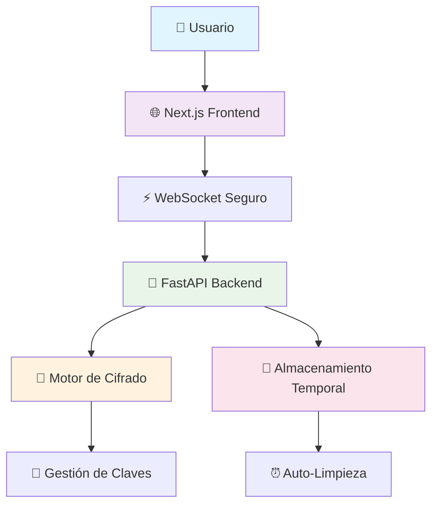
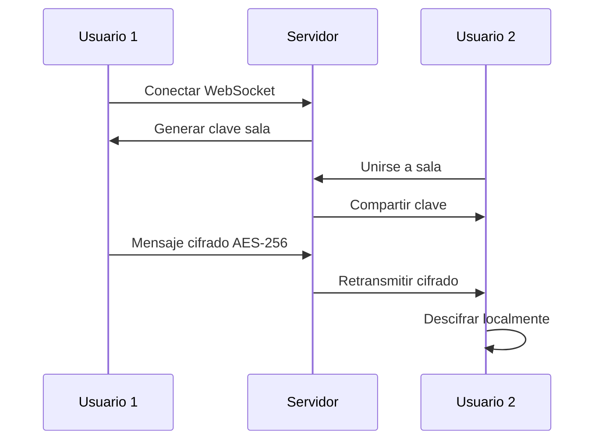

# 🔒 Chat Anónimo - Comunicación Segura y Privada

<div align="center">


**Sistema de chat anónimo con cifrado end-to-end, intercambio seguro de archivos y auto-eliminación**

[🚀 Demo en Vivo](https://write-ghost.netlify.app) | [📖 English](README.en.md) | [🔧 Instalación](#-instalación-y-configuración)

</div>

## 📋 Tabla de Contenidos

- [🌟 Características Principales](#-características-principales)
- [🏗️ Arquitectura del Sistema](#️-arquitectura-del-sistema)
- [🚀 Instalación y Configuración](#-instalación-y-configuración)
- [📖 Guía de Uso](#-guía-de-uso)
- [🔍 Especificaciones de Seguridad](#-especificaciones-de-seguridad)
- [🌍 Deployment](#-deployment)
- [📊 Monitoreo y Métricas](#-monitoreo-y-métricas)
- [🛠️ Desarrollo y Contribución](#️-desarrollo-y-contribución)
- [🔒 Consideraciones de Seguridad](#-consideraciones-de-seguridad)
- [📜 Licencia y Términos](#-licencia-y-términos)
- [📚 Documentación Adicional](#-documentación-adicional)

</div>

---

## 🌟 Características Principales

### 🛡️ **Seguridad Máxima**
- **🔐 Cifrado AES-256-GCM** - Estándar militar para todos los mensajes y archivos
- **🔑 Intercambio de Claves Diffie-Hellman** - Negociación segura de claves sin exposición
- **🚫 Sin Base de Datos** - Cero persistencia de datos sensibles
- **⏰ Auto-Eliminación Inteligente** - Mensajes (10 min) y archivos (30 min)

### 👤 **Anonimato Total**
- **🎭 Identidades Temporales** - Usuarios generados automáticamente
- **🌈 Avatares Únicos** - Colores distintivos sin información personal
- **📊 Sin Registro** - Acceso inmediato sin crear cuentas
- **🔄 Sesiones Efímeras** - Cada conexión es independiente

### 📁 **Intercambio de Archivos Seguro**
- **🔒 Contenido Cifrado** - Archivos protegidos con AES-256
- **🏷️ Metadatos Cifrados** - Nombres y tipos de archivo protegidos
- **📏 Límites Inteligentes** - 15MB por archivo, 5 archivos por usuario
- **🗂️ Tipos Compatibles** - Imágenes, documentos, audio y más

### 🏠 **Salas Privadas**
- **🚪 Creación Instantánea** - Salas temporales con códigos únicos
- **👥 Gestión de Usuarios** - Control de acceso por sala
- **🔐 Cifrado Independiente** - Claves únicas por sala privada
- **📱 Interfaz Responsive** - Optimizado para móviles y escritorio

---

## 🏗️ Arquitectura del Sistema



### 📦 **Arquitectura de Repositorios**

Este proyecto está dividido en **dos repositorios independientes** para mejor organización y despliegue:

| Repositorio | Descripción | Tecnología | Deploy |
|-------------|-------------|------------|--------|
| 🚀 **[chat-backend](https://github.com/h3n-x/chat-backend)** | API y servidor WebSocket | FastAPI + Python | [Render](https://chat-backend-haeb.onrender.com) |
| 🎨 **[chat-frontend](https://github.com/h3n-x/chat-frontend)** | Interfaz de usuario | Next.js + TypeScript | [Netlify](https://write-ghost.netlify.app) |

### 🔗 **Comunicación entre Repositorios**
- **WebSocket**: Comunicación en tiempo real
- **HTTPS/WSS**: Protocolo seguro en producción
- **CORS**: Configurado para permitir origen frontend
- **API REST**: Endpoints para subida de archivos

---

### 🔧 **Stack Tecnológico**

| Componente | Tecnología | Propósito |
|------------|------------|-----------|
| **Frontend** | Next.js 14 + TypeScript | Interfaz moderna y responsive |
| **Backend** | FastAPI + Python | API eficiente con WebSockets |
| **Cifrado** | AES-256-GCM + DH | Seguridad de grado militar |
| **Deployment** | Netlify + Render | Infraestructura escalable |
| **Storage** | Memoria + Archivos Temporales | Sin persistencia |

---

## 🚀 Instalación y Configuración

### 📋 **Requisitos Previos**
- **Python 3.11+** para el backend
- **Node.js 18+** para el frontend
- **Git** para clonar el repositorio

### ⚡ **Instalación Rápida**

```bash
# Clonar repositorios
git clone https://github.com/h3n-x/chat-backend.git
git clone https://github.com/h3n-x/chat-frontend.git

# Configurar Backend
cd chat-backend
pip install -r requirements.txt
python main.py

# Configurar Frontend (nueva terminal)
cd ../chat-frontend
npm install
npm run dev
```

### 🌐 **Configuración de Producción**

#### Backend (Render/Railway)
```bash
# Variables de entorno requeridas
PORT=8000
CORS_ORIGINS=https://tu-frontend.netlify.app
```

#### Frontend (Netlify/Vercel)
```bash
# Build settings
Build command: npm run build
Publish directory: out
```

---

## 📖 Guía de Uso

### 🎯 **Acceso Rápido**
1. **Ingresa al chat** - Sin registro necesario
2. **Elige tu sala** - General o crea una privada
3. **Comienza a chatear** - Cifrado automático activado
4. **Comparte archivos** - Arrastra y suelta archivos

### 🔐 **Salas Privadas**
```
1. Clic en "Crear Sala Privada"
2. Comparte el código de 6 dígitos
3. Máximo 10 usuarios por sala
4. Cifrado independiente por sala
```

### 📁 **Subida de Archivos**
- **Métodos**: Arrastra y suelta o clic en 📎
- **Límites**: 15MB por archivo, 5 archivos por usuario
- **Formatos**: Imágenes, documentos, audio, video
- **Seguridad**: Cifrado automático del contenido y metadatos

---

## 🔍 Especificaciones de Seguridad

### 🛡️ **Niveles de Protección**

| Elemento | Cifrado | Almacenamiento | Retención |
|----------|---------|----------------|-----------|
| **Mensajes** | ✅ AES-256-GCM | 🚫 Solo memoria | ⏰ 10 minutos |
| **Archivos** | ✅ AES-256-GCM | 📁 Temporal cifrado | ⏰ 30 minutos |
| **Metadatos** | ✅ AES-256-GCM | 🚫 Solo memoria | ⏰ Con el archivo |
| **Claves** | ✅ Diffie-Hellman | 🚫 Solo memoria | ⏰ Por sesión |

### 🔒 **Flujo de Cifrado**



### 🔐 **Algoritmos Utilizados**
- **Cifrado Simétrico**: AES-256-GCM (Galois/Counter Mode)
- **Intercambio de Claves**: Diffie-Hellman Ephemeral
- **Integridad**: HMAC integrado en GCM
- **Aleatoriedad**: Nonces criptográficamente seguros

---

## 🌍 Deployment

### 🎯 **URLs de Producción**
- **Frontend**: [https://write-ghost.netlify.app](https://write-ghost.netlify.app)
- **Backend**: [https://chat-backend-haeb.onrender.com](https://chat-backend-haeb.onrender.com)

### ⚙️ **Configuración CORS**
```python
# backend/main.py
app.add_middleware(
    CORSMiddleware,
    allow_origins=["https://write-ghost.netlify.app"],
    allow_credentials=True,
    allow_methods=["*"],
    allow_headers=["*"],
)
```

### 🔧 **Variables de Entorno**
```bash
# Backend
PORT=8000
CORS_ORIGINS=https://write-ghost.netlify.app
MAX_FILE_SIZE=15728640  # 15MB
MAX_FILES_PER_USER=5

# Frontend 
NEXT_PUBLIC_WS_URL=wss://chat-backend-haeb.onrender.com
```

---

## 📊 Monitoreo y Métricas

### 📈 **Límites del Sistema**
- **👥 Usuarios Concurrentes**: Sin límite técnico
- **📁 Archivos Totales**: 30 simultáneos en el sistema
- **💾 Uso de Memoria**: Auto-optimización con limpieza
- **🚀 Latencia**: < 100ms para mensajes

### 🧹 **Auto-Limpieza**
```
⏰ Cada 5 minutos:
  ├── 🗑️ Eliminar mensajes > 10 min
  ├── 🗑️ Eliminar archivos > 30 min
  ├── 🧹 Limpiar memoria de claves
  └── 📊 Log de estadísticas
```

---

## 🛠️ Desarrollo y Contribución

### 🏃‍♂️ **Desarrollo Local**
```bash
# Backend con hot-reload
cd backend
uvicorn main:app --reload --host 0.0.0.0 --port 8000

# Frontend con hot-reload  
cd frontend
npm run dev
```

### 🧪 **Testing**
```bash
# Tests del backend
cd backend
python -m pytest tests/

# Tests del frontend
cd frontend
npm run test
```

### 📝 **Estructura del Proyecto**
```
Chat Anónimo (Monorepo Conceptual)
├── � Backend (chat-backend)
│   ├── Repository: https://github.com/h3n-x/chat-backend.git
│   ├── 🐍 main.py          # Servidor FastAPI principal
│   ├── 🔐 crypto_utils.py  # Motor de cifrado
│   ├── ⚙️ config.py        # Configuración
│   └── 🧪 tests/           # Tests unitarios
├── 🎨 Frontend (chat-frontend)
│   ├── Repository: https://github.com/h3n-x/chat-frontend.git
│   ├── 🎨 app/             # Páginas Next.js
│   ├── 🧩 components/      # Componentes React
│   ├── 🔧 lib/             # Utilidades y API
│   └── 🎯 public/          # Recursos estáticos
└── 📖 README.md            # Este archivo (documentación principal)
```

---

## 📚 Documentación Adicional

- 📖 **[README en Inglés](README.en.md)** - English version of this document
- 🚀 **[Backend Repository](https://github.com/h3n-x/chat-backend)** - API y configuración del servidor
- 🎨 **[Frontend Repository](https://github.com/h3n-x/chat-frontend)** - Interfaz de usuario y componentes
- 🤝 **[Guía de Contribución](CONTRIBUTING.md)** - Cómo contribuir al proyecto
- 📜 **[Licencia](LICENSE)** - Términos y condiciones MIT

---

## 🔒 Consideraciones de Seguridad

### ✅ **Fortalezas Implementadas**
- **Zero-Knowledge**: Servidor no puede leer mensajes
- **Perfect Forward Secrecy**: Claves únicas por sesión
- **Auto-Destrucción**: Eliminación automática garantizada
- **Sin Logs**: Cero almacenamiento de contenido sensible

### ⚠️ **Limitaciones Conocidas**
- **Metadatos de Conexión**: IPs visibles a nivel de infraestructura
- **Persistencia del Cliente**: Cache local temporal
- **Disponibilidad**: Dependiente de infraestructura de terceros

### 🔐 **Recomendaciones de Uso**
- **VPN**: Para ocultar dirección IP real
- **Tor Browser**: Para máximo anonimato de navegación
- **Incógnito**: Evitar cache persistente del navegador

---

## 📜 Licencia y Términos

### 📄 **Licencia MIT**
Este proyecto está bajo la Licencia MIT. Ver [LICENSE](LICENSE) para más detalles.

### ⚖️ **Términos de Uso**
- **Uso Responsable**: No para actividades ilegales
- **Sin Garantías**: Software proporcionado "as-is"
- **Privacidad**: No recopilamos datos personales
- **Contenido**: Los usuarios son responsables de su contenido

---

## 🤝 Soporte y Contacto

### 💬 **Comunidad**
- **Issues**: 
  - [Backend Issues](https://github.com/h3n-x/chat-backend/issues)
  - [Frontend Issues](https://github.com/h3n-x/chat-frontend/issues)
- **Discussions**: 
  - [Backend Discussions](https://github.com/h3n-x/chat-backend/discussions)
  - [Frontend Discussions](https://github.com/h3n-x/chat-frontend/discussions)

### 🔧 **Contribuir**
1. Elige el repositorio apropiado:
   - **Backend**: Fork [chat-backend](https://github.com/h3n-x/chat-backend)
   - **Frontend**: Fork [chat-frontend](https://github.com/h3n-x/chat-frontend)
2. Crea una rama para tu feature (`git checkout -b feature/AmazingFeature`)
3. Commit tus cambios (`git commit -m 'Add some AmazingFeature'`)
4. Push a la rama (`git push origin feature/AmazingFeature`)
5. Abre un Pull Request en el repositorio correspondiente

### 🏆 **Reconocimientos**
- **Cryptography**: Biblioteca de cifrado de Python
- **FastAPI**: Framework web moderno y rápido
- **Next.js**: Framework React de producción
- **Comunidad Open Source**: Por las herramientas increíbles

---

<div align="center">

**Hecho con ❤️ para la privacidad y la libertad de comunicación**


</div>
