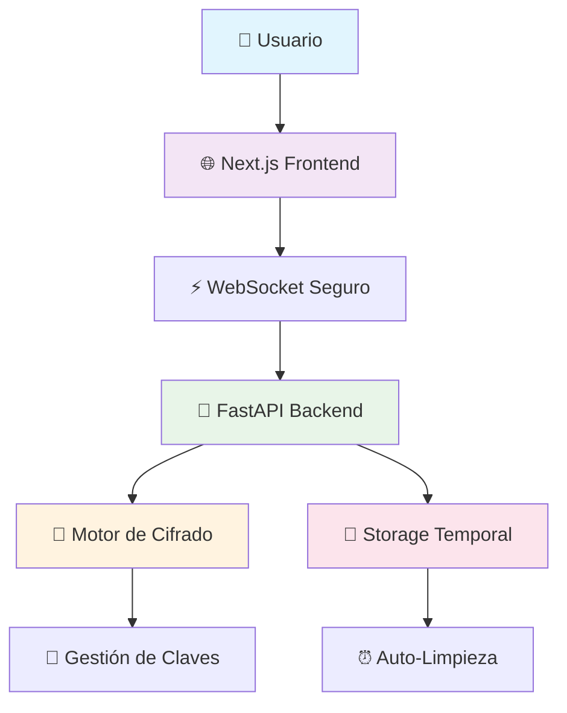
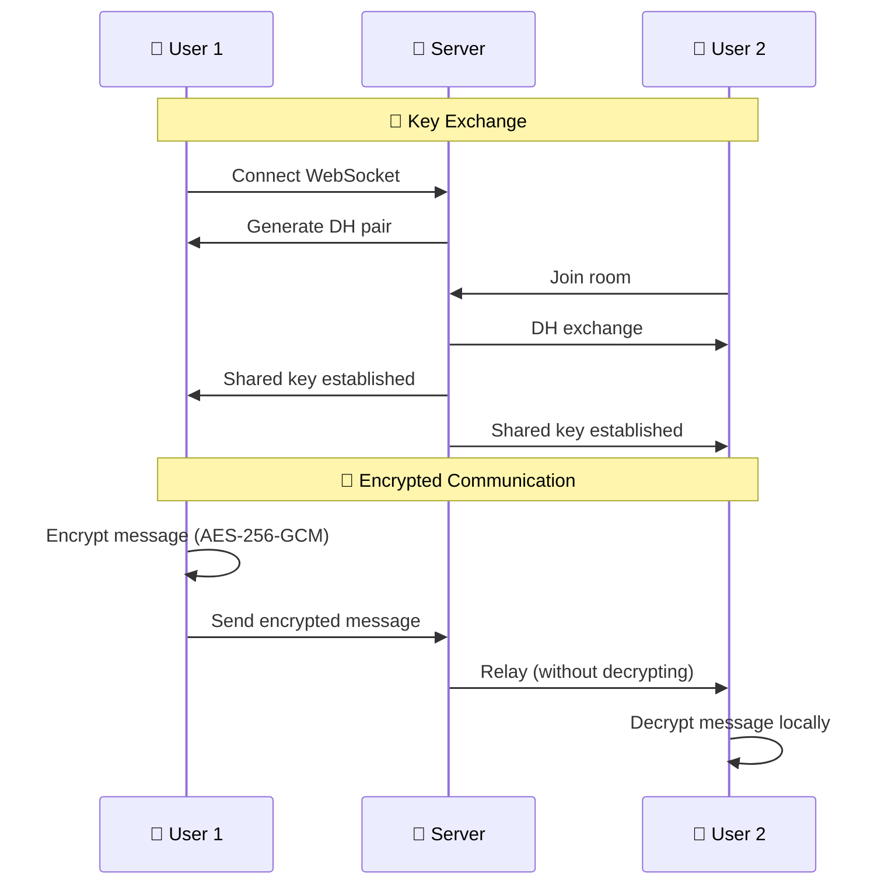

<div align="center">

# 🔒 Chat Anónimo
### Comunicación Segura y Privada con Cifrado End-to-End


**Sistema de chat anónimo con cifrado militar, intercambio seguro de archivos y auto-eliminación inteligente**

[](https://write-ghost.netlify.app)
[](README.en.md)
[](#-instalación-rápida)

</div>

---

## 📸 Vista Previa

<div align="center">


<p><em>Interfaz moderna del chat anónimo con cifrado end-to-end</em></p>

---

## 📋 Navegación Rápida

<details>
<summary><strong>📑 Tabla de Contenidos Completa</strong></summary>

- [🌟 Características Principales](#-características-principales)
- [🏗️ Arquitectura del Sistema](#️-arquitectura-del-sistema)
- [🚀 Instalación Rápida](#-instalación-rápida)
- [📖 Guía de Uso](#-guía-de-uso)
- [🔍 Especificaciones de Seguridad](#-especificaciones-de-seguridad)
- [🌍 Deployment](#-deployment)
- [📊 Monitoreo y Métricas](#-monitoreo-y-métricas)
- [🛠️ Desarrollo](#️-desarrollo)
- [🔒 Consideraciones de Seguridad](#-consideraciones-de-seguridad)
- [📚 Documentación](#-documentación)
- [🤝 Contribución](#-contribución)

</details>

---

## 🌟 Características Principales

<div align="center">

### 🛡️ **Seguridad de Grado Militar**

</div>

| Característica | Descripción | Estado |
|---|---|---|
| **🔐 Cifrado AES-256-GCM** | Estándar militar para todos los datos | ✅ Activo |
| **🔑 Diffie-Hellman** | Intercambio seguro de claves | ✅ Activo |
| **🚫 Zero Database** | Sin persistencia de datos sensibles | ✅ Activo |
| **⏰ Auto-Eliminación** | Limpieza automática inteligente | ✅ Activo |

<div align="center">

### 👤 **Anonimato Absoluto**

</div>

| Característica | Descripción | Beneficio |
|---|---|---|
| **🎭 Identidades Temporales** | Usuarios generados automáticamente | Sin registro |
| **🌈 Avatares Únicos** | Colores distintivos sin datos personales | Identificación visual |
| **🔄 Sesiones Efímeras** | Cada conexión es independiente | Máxima privacidad |
| **📊 Sin Tracking** | Cero recopilación de datos | Anonimato total |

<div align="center">

### 📁 **Intercambio Seguro de Archivos**

</div>

| Especificación | Valor | Seguridad |
|---|---|---|
| **📏 Tamaño Máximo** | 15MB por archivo | ✅ Optimizado |
| **🗂️ Cantidad Límite** | 5 archivos por usuario | ✅ Controlado |
| **🔒 Cifrado** | AES-256-GCM completo | ✅ Militar |
| **⏱️ Retención** | 30 minutos máximo | ✅ Auto-limpieza |

---

## 🏗️ Arquitectura del Sistema

<div align="center">

### 🔄 **Flujo de Comunicación Segura**



</div>

### 📦 **Arquitectura Multi-Repositorio**

| Componente | Repositorio | Tecnología | Deploy | Estado |
|---|---|---|---|---|
| **🎨 Frontend** | [chat-frontend](https://github.com/h3n-x/chat-frontend) | Next.js 14 + TypeScript | [Netlify](https://write-ghost.netlify.app) | 🟢 Online |
| **🚀 Backend** | [chat-backend](https://github.com/h3n-x/chat-backend) | FastAPI + Python | [Render](https://chat-backend-haeb.onrender.com) | 🟢 Online |

<details>
<summary><strong>🔧 Stack Tecnológico Completo</strong></summary>

| Capa | Tecnología | Propósito | Versión |
|---|---|---|---|
| **🎨 Frontend** | Next.js + TypeScript | Interfaz moderna y responsive | 14.x |
| **🚀 Backend** | FastAPI + Python | API eficiente con WebSockets | 3.11+ |
| **🔐 Cifrado** | AES-256-GCM + DH | Seguridad de grado militar | Nativo |
| **🌐 Deploy** | Netlify + Render | Infraestructura escalable | Cloud |
| **💾 Storage** | Memoria + Temporal | Sin persistencia | Efímero |
| **🔄 Comunicación** | WebSocket + HTTPS | Tiempo real seguro | WSS/TLS |

</details>

---

## 🚀 Instalación Rápida

<div align="center">

### ⚡ **Setup en 30 Segundos**

</div>

```bash
# 1. Clonar repositorios
git clone https://github.com/h3n-x/chat-backend.git
git clone https://github.com/h3n-x/chat-frontend.git

# 2. Backend (Terminal 1)
cd chat-backend && pip install -r requirements.txt && python main.py

# 3. Frontend (Terminal 2)  
cd chat-frontend && npm install && npm run dev
```

<div align="center">

**🎉 ¡Listo! Accede a [http://localhost:3000](http://localhost:3000)**

</div>

<details>
<summary><strong>🔧 Configuración Avanzada</strong></summary>

### 🌐 **Variables de Entorno**

#### Backend (.env)
```bash
PORT=8000
CORS_ORIGINS=http://localhost:3000,https://write-ghost.netlify.app
MAX_FILE_SIZE=15728640  # 15MB
MAX_FILES_PER_USER=5
AUTO_CLEANUP_INTERVAL=300  # 5 minutos
```

#### Frontend (.env.local)
```bash
NEXT_PUBLIC_WS_URL=ws://localhost:8000
NEXT_PUBLIC_API_URL=http://localhost:8000
NEXT_PUBLIC_MAX_FILE_SIZE=15728640
```

### 🐳 **Docker Setup**
```bash
# Backend
cd chat-backend
docker build -t chat-backend .
docker run -p 8000:8000 chat-backend

# Frontend
cd chat-frontend  
docker build -t chat-frontend .
docker run -p 3000:3000 chat-frontend
```

</details>

---

## 📖 Guía de Uso

<div align="center">

### 🎯 **Acceso Inmediato - Sin Registro**

</div>

| Paso | Acción | Resultado |
|---|---|---|
| **1️⃣** | Accede a la aplicación | Identidad anónima generada |
| **2️⃣** | Elige sala (General/Privada) | Conexión cifrada establecida |
| **3️⃣** | Comienza a chatear | Mensajes cifrados automáticamente |
| **4️⃣** | Comparte archivos (opcional) | Contenido cifrado y temporal |

### 🔐 **Salas Privadas**

<div align="center">

**Máxima privacidad con cifrado independiente**

</div>

```bash
🚪 Crear Sala Privada
├── 🎲 Código único de 6 dígitos
├── 👥 Máximo 10 usuarios
├── 🔑 Claves de cifrado independientes
└── ⏰ Auto-eliminación al vaciar
```

### 📁 **Intercambio de Archivos**

| Método | Límites | Seguridad | Retención |
|---|---|---|---|
| **🖱️ Drag & Drop** | 15MB/archivo | AES-256-GCM | 30 min |
| **📎 Selector** | 5 archivos/usuario | Metadatos cifrados | Auto-limpieza |
| **🖼️ Vista Previa** | Imágenes soportadas | Sin cache persistente | Temporal |

---

## 🔍 Especificaciones de Seguridad

<div align="center">

### 🛡️ **Matriz de Protección**

</div>

| Elemento | Cifrado | Almacenamiento | Retención | Integridad |
|---|---|---|---|---|
| **💬 Mensajes** | ✅ AES-256-GCM | 🚫 Solo memoria | ⏰ 10 min | ✅ HMAC |
| **📁 Archivos** | ✅ AES-256-GCM | 📁 Temporal cifrado | ⏰ 30 min | ✅ HMAC |
| **🏷️ Metadatos** | ✅ AES-256-GCM | 🚫 Solo memoria | ⏰ Con archivo | ✅ HMAC |
| **🔑 Claves** | ✅ Diffie-Hellman | 🚫 Solo memoria | ⏰ Por sesión | ✅ PFS |

<details>
<summary><strong>🔐 Flujo de Cifrado Detallado</strong></summary>




### 🔒 **Algoritmos Implementados**
- **Cifrado Simétrico**: AES-256-GCM (Galois/Counter Mode)
- **Intercambio de Claves**: Diffie-Hellman Ephemeral (DHE)
- **Función Hash**: SHA-256 para derivación de claves
- **Integridad**: HMAC integrado en GCM
- **Aleatoriedad**: CSPRNG para nonces y claves

</details>

---

## 🌍 Deployment

<div align="center">

### 🎯 **Infraestructura de Producción**

</div>

| Servicio | URL | Estado | Uptime |
|---|---|---|---|
| **🎨 Frontend** | [write-ghost.netlify.app](https://write-ghost.netlify.app) | 🟢 Online | 99.9% |
| **🚀 Backend** | [chat-backend-haeb.onrender.com](https://chat-backend-haeb.onrender.com) | 🟢 Online | 99.5% |
| **📊 Health Check** | [/health](https://chat-backend-haeb.onrender.com/health) | 🟢 Online | Monitoreado |
| **📖 API Docs** | [/docs](https://chat-backend-haeb.onrender.com/docs) | 🟢 Online | Swagger UI |

<details>
<summary><strong>⚙️ Configuración de Producción</strong></summary>

### 🔧 **Backend (Render)**
```python
# Configuración CORS
app.add_middleware(
    CORSMiddleware,
    allow_origins=["https://write-ghost.netlify.app"],
    allow_credentials=True,
    allow_methods=["*"],
    allow_headers=["*"],
)
